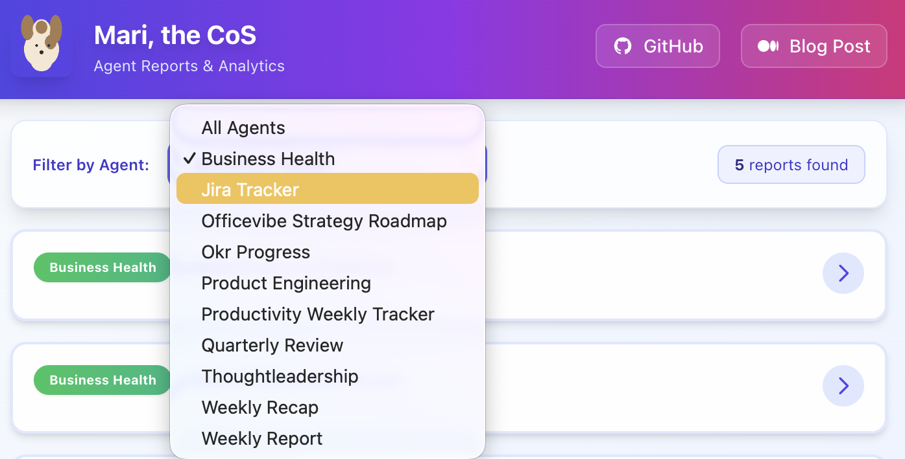
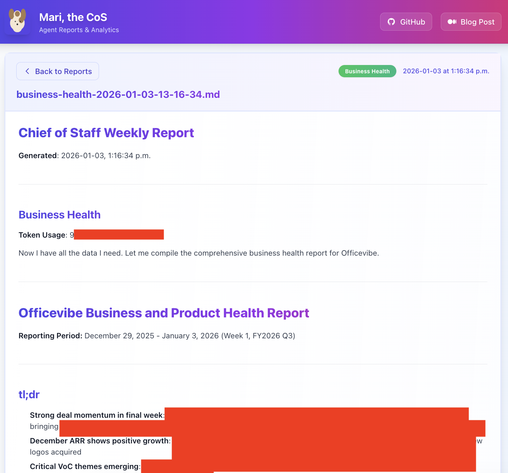

# Mari, the Chief of Staff Frontend Dashboard

A modern web dashboard for viewing and filtering agent reports from Mari, the Chief of Staff system.

## Features

- 📊 View all agent reports from the `reports/` folder
- 🔍 Filter reports by agent type (okr-progress, product-engineering, business-health, etc.)
- 📝 Beautiful markdown rendering with syntax highlighting
- 🎨 Modern, responsive UI built with React and Tailwind CSS
- ⚡ Fast and lightweight with Vite

## Setup

1. Install dependencies:
```bash
npm install
```

2. Start the API server (in one terminal):
```bash
npm run server
```

3. Start the development server (in another terminal):
```bash
npm run dev
```

4. Open your browser to `http://localhost:3000`

## Available Agents

The dashboard automatically detects all agent types from the reports folder. Common agents include:

- **okr-progress** - OKR tracking and progress reports
- **product-engineering** - Development progress and launches
- **business-health** - ARR metrics, deals, and churn analysis
- **weekly-recap** - Weekly team communications and activities
- And more...

## Project Structure

```
frontend/
├── src/
│   ├── components/
│   │   ├── FilterBar.jsx      # Agent filtering UI
│   │   ├── ReportList.jsx     # List of reports
│   │   └── ReportViewer.jsx   # Markdown report viewer
│   ├── App.jsx                # Main app component
│   ├── main.jsx               # Entry point
│   └── index.css              # Global styles
├── server.js                  # Express API server
├── package.json
└── vite.config.js
```

## API Endpoints

The Express server provides:

- `GET /api/reports` - Get all reports with metadata
- `GET /api/reports/:filename` - Get specific report content
- `GET /api/agents` - Get list of unique agent names

## Podcast (md2podcast) configuration

The dashboard can trigger a local `md2podcast` script to convert any generated Markdown report into an MP3. Configure either:

- Environment variable: `MD2PODCAST_PATH` (path to executable or Python script)
- Or add `md2podcastPath` to the project's `config.json` at repository root.

Defaults: the server uses `edge` as the default engine and default voice/rate values if not provided.
You can override defaults via environment variables:

- `MD2PODCAST_ENGINE` (default: `edge`)
- `MD2PODCAST_VOICE` (default: empty)
- `MD2PODCAST_RATE` (default: `1.0`)

Or set these in `config.json` as `md2podcastEngine`, `md2podcastVoice`, and `md2podcastRate`.

Example (start server with env var):
```bash
export OPENAI_API_KEY="sk_xxx"
export MD2PODCAST_PATH="/home/pi/Documents/GitHub/md-to-podcast/md2podcast.py"
node frontend/server.js
```

Once configured, open a report in the UI and click **Create Podcast**. The server will run the configured script and place the MP3 next to the report in `reports/`. You can also trigger conversion via the API:

```bash
curl -X POST "http://localhost:3001/api/reports/<REPORT_FILENAME>/podcast" \
	-H 'Content-Type: application/json' \
	-d '{"engine":"edge","voice":"","rate":1.0}'
```

The endpoint returns an `executionId` you can use to poll `/api/execution/:executionId` for logs/status, and then download the MP3 at:

```
GET /api/reports/<REPORT_FILENAME>/podcast
```

Notes:
- Ensure any external TTS provider credentials (e.g., `OPENAI_API_KEY` for OpenAI) are set in the environment where `frontend/server.js` runs.
- The server validates filenames to prevent path traversal and runs the configured script with controlled arguments only.

## Building for Production

```bash
npm run build
```

The built files will be in the `dist/` folder.


## Screenshots

For now, it's looking at the reports folder and cateogrizing and listing out all reports it can find:


Here is an example report - I "red-out" company details.


